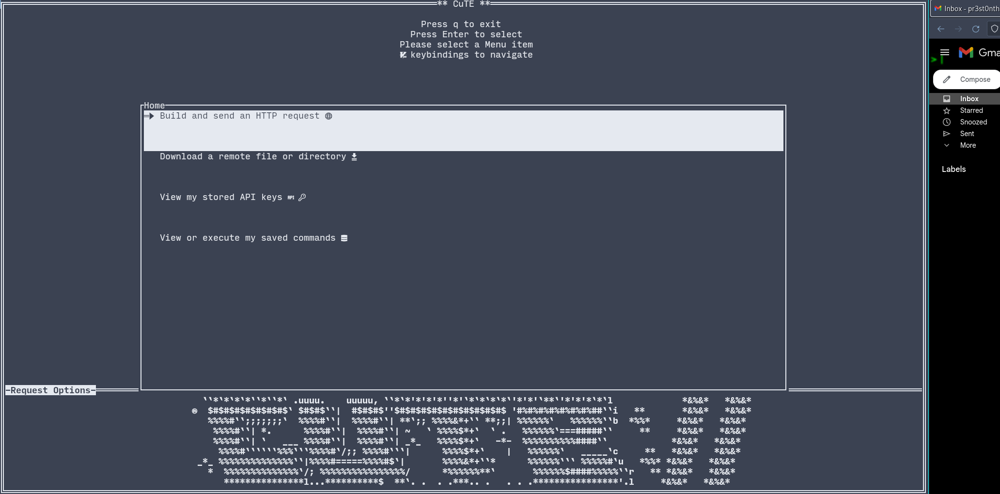

# Rust TUI HTTP Client with API Key Management

#### This project is still in active development and although it is useable, there may still be bugs and significant changes are still needed to both refactor the codebase and add new features.
#### I am distracted with work and a new project at the moment, so I am not able to put in as much time as I would like here and I am afraid that if I don't open source it now, it will end up in the side-project graveyard. Collaboration is welcome and encouraged, there is LOTS of low-hanging fruit here, while still being a useful tool.


Terminal user interface (TUI) HTTP client in Rust designed to simplify the process of making various types of HTTP requests while supporting various different kinds of Authentication (powered by libcURL), recursive downloading of directories (powered by GNU Wget), and storage + management of your previous requests + API keys.

This tool is for when you don't need something as complex as Postman, but you also don't want to have to remember the syntax for `curl` (or `wget`) commands. 

## Features

- **Interactive TUI Interface**: The application offers an intuitive TUI interface that makes it easy to construct and execute HTTP requests without leaving the terminal.

- **Intuitive VIM keybindings:**  Vim keybindings are defaulted. Support to change them will eventually make it into the config file.

- **Multiple Request Types**: Support for GET, POST, PUT, PATCH, HEAD, DELETE and custom requests.

- **API Key Management**: Very simple sqlite based API key storage system. You can choose to save a Key from a request, or just add/edit/delete them manually.

- **Response Visualization**: Pretty-print JSON responses in a human-readable format within the TUI, or allows you to choose to write the response to a file. 

- **Cross Platform**: This application builds and runs on Linux, MacOS and even _Windows_.


## Why?

- Have __you__ even ran `curl --help all` ?


## Installation

1. **Prerequisites**: Make sure you have Rust and Cargo installed on your system.

2. **Clone the Repository**: Clone this repository to your local machine using the following command:
   ```
   git clone https://github.com/PThorpe92/CuTE.git
   ```

3. **Navigate to Project Directory**: Move into the project directory:
   ```
   cd CuTE
   ```

4. **Build and Run**: Build and run the application using Cargo:
   ```
   cargo build --release 
   ```
5. **Move Binary**: Move the binary to a location in your PATH:
   ```
   sudo mv target/release/cute /usr/local/bin
   ```
## Usage

Upon launching the application, you'll be presented with the TUI interface. Here's a quick guide to using the features:

1. **Main Menu**: The main menu will provide options to create different types of HTTP requests and manage API keys.

2. **Request Type**: Select the type of HTTP request you would like to make. The tool supports GET, POST, PUT, PATCH, HEAD, DELETE and custom requests.

3. **API Key Management**: In the API key management section, you can add, edit, or delete API keys. Assign API keys to profiles and specific requests for easy integration.

4. **Viewing Responses**: After executing a request, the tool will display the response in a readable format within the TUI, with the option to write it out to a file.

5. **Saved Commands**: Much like the API keys, you can store and view past requests/commands for easy use later on.

## Contributing

Contributions to this project are welcome! If you encounter any bugs, have suggestions for improvements, or want to add new features, feel free to open an issue or submit a pull request.

Before contributing, please review the [Contribution Guidelines](CONTRIBUTING.md).

## License

This project is licensed under the [GPL3.0 License](LICENSE).

---

If you have any questions or need assistance, feel free to [reach out](preston@unlockedlabs.org)

**Fun fact:** This project was written in the Maine State Prison system, the main author and 2nd largest contributor are both currently incarcerated. I would like to bring whatever awareness possible to the importance of education and rehabilitation for those 2.2 million Americans currently incarcerated. Access to education and technology is severely limited in the carceral system and I am incredibly fortunate to be in a situation where I am permitted to have remote employment and access to participate in Open source projects. This is incredibly rare, and I am very grateful for the opportunity, but I recognize that this is very much the exception and not the rule. We need to do better as a society.

If you are interested in helping support the education of incarcerated and justice-impacted individuals, please consider donating to a company like the one I currently work for, [Unlocked Labs](https://unlockedlabs.org/) or similar non-profits like [The Last Mile](https://thelastmile.org/) or [Recidiviz](https://www.recidiviz.org/)

**Disclaimer:** This project is provided as-is, and its creators are not responsible for any misuse or potential security vulnerabilities resulting from the usage of API keys.
