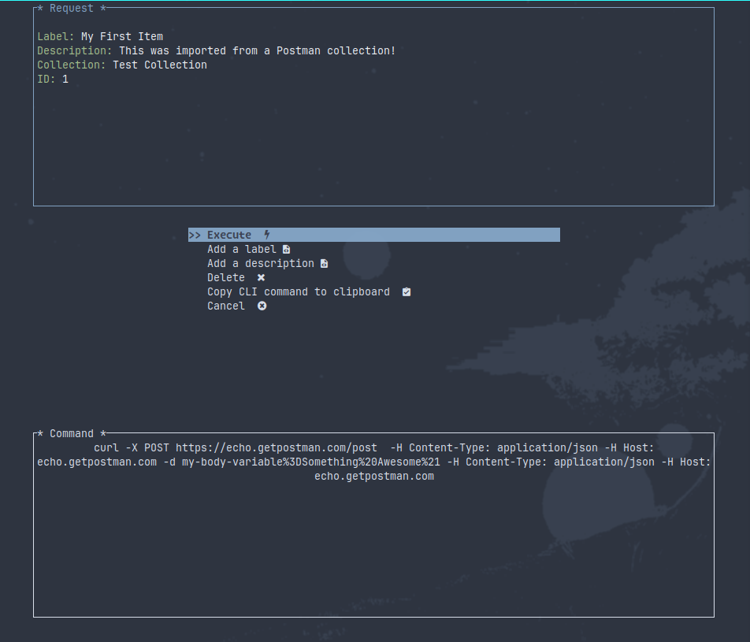
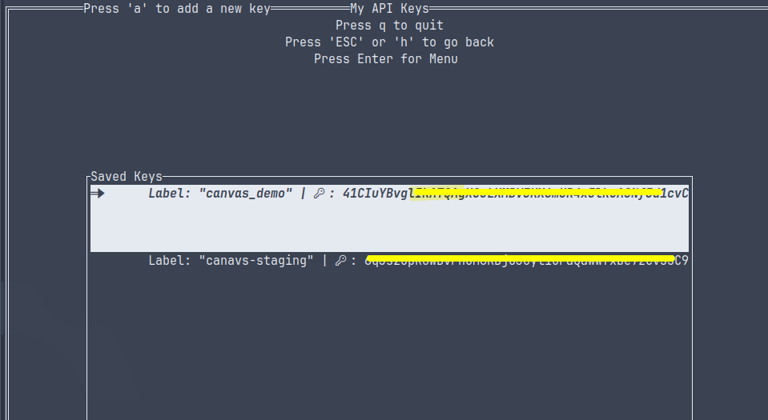

<div class="parent_div" style="text-align:center;">

</div>


# TUI HTTP Client with API/Auth Key Management and Request History/Storage

> This project is still in active development and although it is useable, there may still be bugs and significant changes are still needed to both refactor the codebase and add new features.
#### Collaboration is welcome and encouraged! There is lots of low hanging fruit 👍 and cool ideas for additional features.


Curl TUI Environment (CuTE). HTTP client/libcurl front-end in Rust, using the awesome [ratatui](https://github.com/ratatui-org/ratatui) library designed to simplify the process of sending HTTP requests in the terminal, allowing you to store and manage your previous requests + API keys.

This is a tool for when your requests are not complex enough for something like Postman, but more complicated than you would want to use `curl` CLI, or if you just don't want to remember all those commands. You can make a few requests to your back-ends for testing, set up with your API key and save the requests to be executed again later. 

**New**: We now support importing your `Postman` collections, so you can have easy access to your APIs without leaving the terminal. (note: `https://schema.getpostman.com/json/collection/v2.1.0/` is currently the only supported collection schema)




## Features

- **Interactive TUI Interface**: Intuitive TUI interface that makes it fast and easy to construct and execute HTTP requests without leaving the terminal.

- **Intuitive VIM keybindings:**  Vim-like keybindings are _defaulted_. Support to change them will eventually make it into the config file.
(`h` or `b` is used to go back a page, `j` and `k` move the cursor up and down. `i` for insert mode while in an input box, `enter` to submit the form and `esc` to exit insert mode)

- **API Key Management**: Very simple sqlite based API key storage system. You can choose to save a Key from a request, or add/edit/delete/rename them.

- **Postman Collections**: Import your postman collections to have easy access to your APIs without leaving the terminal.

- **Response Visualization**: Pretty-print JSON responses in a human-readable format within the TUI, then you can choose to write the response to a file after inspecting it. You an also copy the `curl` CLI command needed to make the same request to your clipboard.

- This application builds and runs on Linux, Windows and MacOS.

## Why?

- Have __you__ even ran `curl --help all` ?

- I made this because I needed it. As a back-end dev that is testing API's daily, Postman is great but I have enough electron apps running as it is, and I live in the terminal.


## Installation

#### Prebuilt binaries for non `smelly-nerds` are available on the [Releases](https://github.com/PThorpe92/CuTE/tags) page (currently just x86-linux)

### Install with Cargo:

- **Prerequisites**: Make sure you have Rust and Cargo installed on your system.

 1. `cargo install CuTE-tui`

 2. make sure that your `~/.cargo/bin` directory is in your PATH

 3. `cute` or `cute --dump-config .`  # this will put a config.toml file in your cwd. You can edit this and place it
                          in a dir in the `~/.config/CuTE` path (see below) to customize the colors and some behavior of the application.


### Build from source:
1. **Prerequisites**: Make sure you have Rust and Cargo installed on your system.

2. **Clone the Repository**: Clone this repository to your local machine using the following command:
   ```
   git clone https://github.com/PThorpe92/CuTE.git && cd CuTE
   ```

3. **Build and Run**: Build and run the application using Cargo:
   ```
   cargo build --release 
   ```
4. **Move Binary**: Move the binary to a location in your PATH of your choosing:
   ```
   cp target/release/cute ~/.local/bin/
   ```

## Command Line Options

#### cute [OPTIONAL] '--dump-config <PATH>' or '--db-path <'/PATH/to/cute.db'>'

- **--dump-config**: Dumps the default config.toml file to the specified path. If no path is specified, it will output it to the current working directory.
  - This `config.toml` file needs to be placed in `~/.config/CuTE/{config.toml}` in order for the application to read it.
  - currently the config file can only specify basic colors of the application, and the path to the sqlite database. More options will be added in the future.

- **--db-path**: Specify the path to the sqlite database. If no path is specified, it will default to `data_local_dir` working directory.(~/.local/share/CuTE/CuTE.db or the windows/macos equivalent)

#### Menus

1. **Main Menu**: The main menu will provide options to create different types of HTTP requests and manage API keys.

2. **Request Type**: Select the type of HTTP request you would like to make. The tool supports GET, POST, PUT, PATCH, HEAD, DELETE and custom requests.

3. **API Key Management**: In the API key management section, you can add, edit, or delete API keys. Assign API keys to profiles and specific requests for easy integration.

4. **Viewing Responses**: After executing a request, the tool will display the response in a readable format within the TUI, with the option to write it out to a file.

5. **Saved Commands**: Much like the API keys, you can store and view past requests/commands for easy use later on.


## Contributing

Contributions to this project are welcome and encouraged! If you encounter any bugs, have suggestions for improvements, or want to add a new feature, feel free to open an issue or submit a PR.

Before contributing, please review the [Contribution Guidelines](CONTRIBUTING.md).


## License

This project is licensed under the [GPL3.0 License](LICENSE).

---
If you have any questions or need assistance, feel free to [reach out](p@eza.rocks)


## **Fun fact:**

>This project was developed in the Maine State Prison system, where the author is currently incarcerated. I would like to bring whatever awareness possible to the importance of education and rehabilitation for those 2.2 million Americans currently incarcerated. I have a [blog post](https://pthorpe92.github.io/intro/my-story/) if you are interested in reading about my story.


**Disclaimer:** This project is provided as-is, and its creators are not responsible for any misuse or potential security vulnerabilities resulting from the usage of API keys.
